# Image Style Transfer

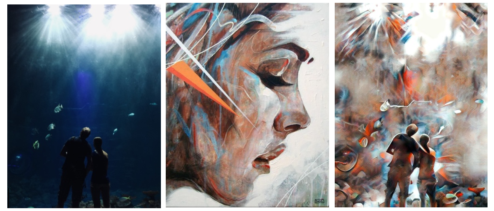

This project is a study of how image style transfer can be implemented using Keras. We implement a Convolutional Neural Network introduced by Gatys et al and Universal Style Transfer via Featire Transforms by Li et al.The project is being run on Nvidia Jetson TX2 as a main devices. We also provid an interactive application to let you see the result of the style transfering which can be found in the section belows.

Image Style Transfer / Neural Style Transfer is process of applying the style of the reference image to a target image while conserving the content of the target image.
* Style means textrues, colors, and visual patterns in the image, at various spatial scales.
* Content is the higher-level macrostructure of the image.

# Methodology

## Tools

-	Nvidia Jetpack 3.3
- Python 3.5.2
-	Tensorflow GPU 1.9.0 with nv18.8 from Jetpack 3
-	Scipy 1.1.9
-	Keras 2.2.4
-	Jupyter 1.0.0

## Hardware

- Nvidia Jetson TX2

## Implementation

### 1st implementation: “A Neural Algorithm of Artistic Style” – Leon Gatys et al.

&nbsp;&nbsp;&nbsp;&nbsp;&nbsp;&nbsp;Originally introduced by Leon Gatys and the team, they studied how to use pretrained Convolutional Neural Network (CNN) to reproduce painting styles on new images. CNN is powerful Deep Neural Network that used for various image processing tasks. It consists of layers of small computational units that process visual information hierarchically in a feed-forward-manner. Deep Feedforward network is a network that the flow of information takes place in the forward direction, as x is used to calculate some intermediate function in the hidden layer which in turn is used to calculate y. The goal of feed forward is to approximate some function f*.; to learn more about Deep feedforward networks visit : https://towardsdatascience.com/deep-learning-feedforward-neural-network-26a6705dbdc7. In CNN, each layer of units can extract a certain feature from the input image. The example of how the CNN can extract the feature can be found in the Magma Jupyter Notebook task or in the following Figure 1. So, we will use this feature of CNN for representing features of the images.

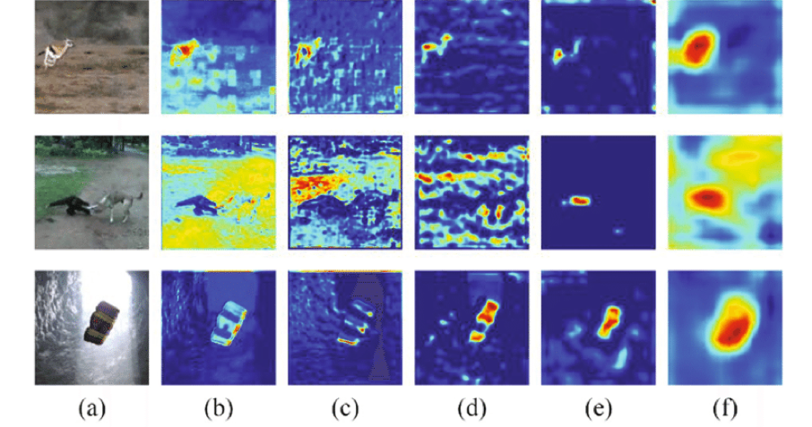

&nbsp;&nbsp;&nbsp;&nbsp;&nbsp;&nbsp;Figure 1: Visualization of feature maps from different VGG convolutional layers. (a) Original Image. (b)-(f) features extracted from conv1-2, conv2-2, conv3-3, conv4-3 and conv5-3 layers respectively. It can be seen that the latter layer features have strengths at semantical discrimination of the object. However, the details of the object contour suffer loss with the network forwarding; Figure by Xiaodong Ning and Lixiong Liu.

&nbsp;&nbsp;&nbsp;&nbsp;&nbsp;&nbsp;When we’re using CNN, the visual information moves along the hierarchy, the input image is process in a way “give more caring into the pixel detailed”. The higher level of the network captures the high-level contents in term of object and their arrangement in the image, but it didn’t keep the exact pixel values of the original image. Gatys et al research suggested that we should use a result from layer conv1_1, conv2_2, or conv3_3 as a content representation, because they can capture the higher level of the content while conserving the original content of the images. In the Jupyter notebook “ImageStyleTransfer-VGG16” in the repository we’ll use conv2_2 as a content representation layer. For style representation, Gaty used specially designed feature space to capture the texture information of the style images. This feature space is built on top of the filter responses in each layer of the network. It consists of the correlations between the different filter responses over the spatial extent of the feature maps. Their techniques produce the texturized version of the input image that capture its general appearance in terms of color and localized structures. They refer the result of this techniques as a style representation. They reconstruct the style of the input image from style representations built on different subsets of CNN layers. In our implementation we used block1_conv2, block2_conv2, block3_conv3, block4_conv3, and block5_conv3.

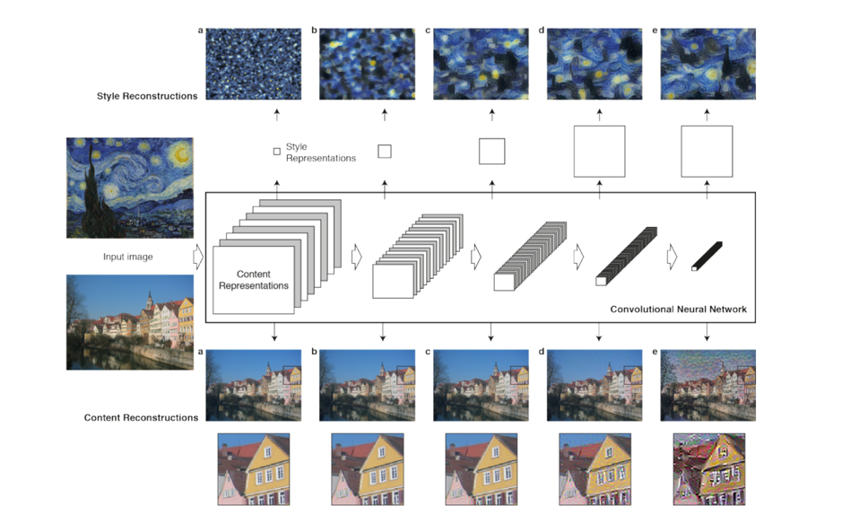

&nbsp;&nbsp;&nbsp;&nbsp;&nbsp;&nbsp;Figure 2: Showing content reconstruction from ‘conv1_1’ (a), ‘conv2_1’ (b), ‘conv3_1’ (c), ‘conv4_1’ (d) and ‘conv5_1’ (e) of the original VGG-Network and style reconstruction from ‘conv1_1’ (a), ‘conv1_1’ and ‘conv2_1’ (b), ‘conv1_1’, ‘conv2_1’ and ‘conv3_1’ (c), ‘conv1_1’, ‘conv2_1’, ‘conv3_1’ and ‘conv4_1’ (d), ‘conv1_1’, ‘conv2_1’, ‘conv3_1’, ‘conv4_1’ and ‘conv5_1’ (e). Figure by Gatys et al research.

&nbsp;&nbsp;&nbsp;&nbsp;&nbsp;&nbsp;The extraction of content and style representation by using the CNN showed that the process is separable from each other. It means that we can extract content from one image and the style from the others independently. With both content and style representation ready at our hand, we can reproduce a new image with content from content representation and style from style representation. How the output image is being process is synthesized by finding an image that simultaneously matches the content representation of the photograph and the style representation of the respective piece of art while preserving the global arrangement of the original photograph, the colors and local structures that compose the global scenery are provided by the artwork.

#### Model

&nbsp;&nbsp;&nbsp;&nbsp;&nbsp;&nbsp;In this implementation, we use VGG16 by K. Simonyan and A. Zisserman from the University of Oxford as a pretrained CNN. Keras has provided this model as a part of its library. We aren’t use the model for the prediction as the same as what we do in MNIST. We only use VGG16 for extract features for content and style representation.

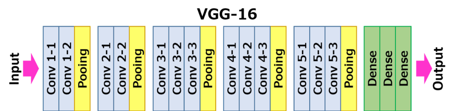

&nbsp;&nbsp;&nbsp;&nbsp;&nbsp;&nbsp;Figure 3: Overview structure of the VGG16 network, Figure from Accelerating Very Deep Convolutional Networks for Classification and Detection by Xiangyu Zhang et al.

#### Methodology

&nbsp;&nbsp;&nbsp;&nbsp;&nbsp;&nbsp;As we briefly explain how this implementation work in the previous section, the implementation we’ve made can be divide in to various steps. 

##### 1st step: Preprocessing Image

&nbsp;&nbsp;&nbsp;&nbsp;&nbsp;&nbsp;Firsts we load the content and style images then doing a preprocessing to both images. The preprocessing tasks include resizing the image, perform reshaping into BGR, and mean normalization. The reason why we need to resize the image because the limited capability of our Jetson TX2 device. From the experiment I made around this implementation, the result show that the biggest image it could handle is the image with maximum size of 512 otherwise we’ll face an exception because the device run out of memory. How we preprocessing the code is in following figure.

```python
img = img.resize((IMAGE_WIDTH, IMAGE_HEIGHT), Image.ANTIALIAS)
# Mean Normalization and Reshaping to BGR
img = keras_image.img_to_array(img, dtype = 'float32')
img = np.expand_dims(img,axis = 0)
img[:,:,:,0] -= IMAGENET_MEAN_RGB_VALUES[2]
img[:,:,:,1] -= IMAGENET_MEAN_RGB_VALUES[1]
img[:,:,:,2] -= IMAGENET_MEAN_RGB_VALUES[0]
img = img[:,:,:,::-1]
```
&nbsp;&nbsp;&nbsp;&nbsp;&nbsp;&nbsp;Figure 4 : Image preprocessing code

##### 2nd step: Define the layer we want to use for feature extracting

&nbsp;&nbsp;&nbsp;&nbsp;&nbsp;&nbsp;As we mention above that we’ll use only some of the layer to do feature extraction, in our implementation, we used “block2_conv2” for content feature extraction due to what Johnson et al research said. For style feature extraction, we’ll use multiple layer including “block1_conv2”, “block2_conv2”, “block3_conv3”, “block4_conv3”, and “block5_conv3”.

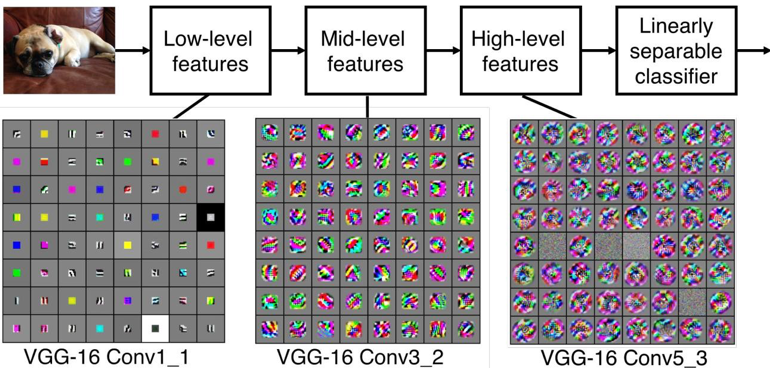

&nbsp;&nbsp;&nbsp;&nbsp;&nbsp;&nbsp;Figure 5: VGG16 Features, show what each layer in VGG16 actually see and what is the content in each block.

##### 3rd step: Finding content loss

&nbsp;&nbsp;&nbsp;&nbsp;&nbsp;&nbsp;In order to find content loss, we need to pass the network both the desired content image and our base input image. This will return the intermediate layer outputs (from the layers defined above) from our model. Then we find the Euclidean distance between the two intermediate representations of those images. Content loss function can be defined like the following function.

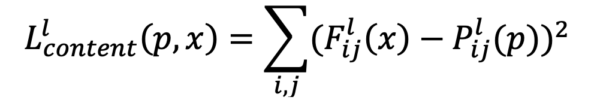

&nbsp;&nbsp;&nbsp;&nbsp;&nbsp;&nbsp;Figure 6: Loss content function

&nbsp;&nbsp;&nbsp;&nbsp;&nbsp;&nbsp;Where x is content from input image, p is content image. F_ij^l (x) and P_ij^l (p) is the result from filter in CNN network at layer l.

```python
def content_loss(content, combination): 
  return backend.sum(backend.square(combination - content))
```

&nbsp;&nbsp;&nbsp;&nbsp;&nbsp;&nbsp;Figure 7: Content loss finding method

##### 4th step: Finding style loss

&nbsp;&nbsp;&nbsp;&nbsp;&nbsp;&nbsp;Finding style loss work under the same as finding content loss, style loss is also defined as a distance between two images. However, in order to apply a new style, style loss is defined as a distance between a style image and an output image. On top of the CNN responses in each layer of the network we built a style representation that computes the correlations between the different filter responses, where the expectation is taken over the spatial extend of the input image. The correlation for these features is Gram Matrix. In order to generate a texture that matches the style of a given image, the gradient descent from a white noise image is being used to find another image that matches the style representation of the original image. This process can be done by minimizing the mean-squared distance
between the entries of the Gram matrix from the original image and the Gram matrix of the
image to be generated.

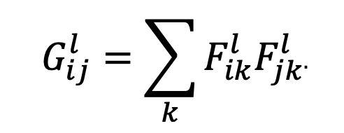

&nbsp;&nbsp;&nbsp;&nbsp;&nbsp;&nbsp;Figure 8: Gram Matrix Function

```python
def gram_matrix(x): 
  features = backend.batch_flatten(backend.permute_dimensions(x, (2, 0, 1))) 
  gram = backend.dot(features, backend.transpose(features)) 
  return gram
```
&nbsp;&nbsp;&nbsp;&nbsp;&nbsp;&nbsp;Figure 9: Gram Matrix Finding Function

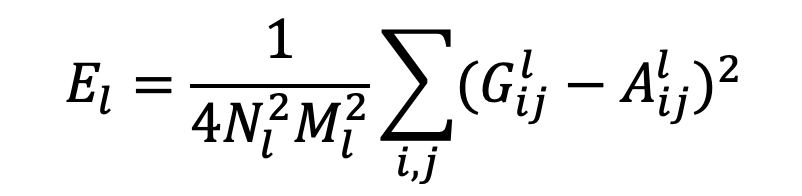

&nbsp;&nbsp;&nbsp;&nbsp;&nbsp;&nbsp;Figure 10:  Minimizing the mean squared distance between the feature correlation map of the style image and the input image

```python
def compute_style_loss(style, combination):
  style = gram_matrix(style)
  combination = gram_matrix(combination)
  size = IMAGE_HEIGHT * IMAGE_WIDTH 
  return backend.sum(backend.square(style - combination)) / (4. * (CHANNELS ** 2) * (size ** 2))
```

&nbsp;&nbsp;&nbsp;&nbsp;&nbsp;&nbsp;Figure 11: Minimizing the mean squared distance method

##### Step 5: Finding total variation loss

&nbsp;&nbsp;&nbsp;&nbsp;&nbsp;&nbsp;Total variation loss is going to act as a spatial smoother to regularize image and prevent its denoising.

```python
def total_variation_loss(x):
    a = backend.square(x[:, :IMAGE_HEIGHT-1, :IMAGE_WIDTH-1, :] - x[:, 1:, :IMAGE_WIDTH-1, :])
    b = backend.square(x[:, :IMAGE_HEIGHT-1, :IMAGE_WIDTH-1, :] - x[:, :IMAGE_HEIGHT-1, 1:, :])
    return backend.sum(backend.pow(a + b, TOTAL_VARIATION_LOSS_FACTOR))
```

&nbsp;&nbsp;&nbsp;&nbsp;&nbsp;&nbsp;Figure 12: Total variation loss finding method

##### Step 6: Using Limited-memory BFGS(L-BFGS) to optimize global loss

&nbsp;&nbsp;&nbsp;&nbsp;&nbsp;&nbsp;We’re using L-BFGS algorithm, which is optimization algorithm designed for limited computation memory devices, to optimize the global loss. In each iteration of optimization, we are going to create an output image so that the distance (difference) between output and input/style on corresponding feature layers is minimized. That why we’ll get better image each time the iteration finished.

```python
for i in range(ITERATIONS):
    x, loss, info = fmin_l_bfgs_b(evaluator.loss, x.flatten(), fprime=evaluator.gradients, maxfun=20)
    print("Iteration %d completed with loss %d" % (i, loss))
    results.append(x)
```

&nbsp;&nbsp;&nbsp;&nbsp;&nbsp;&nbsp;Figure 13: Iterate and optimizing the global loss

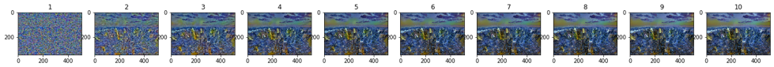

&nbsp;&nbsp;&nbsp;&nbsp;&nbsp;&nbsp;Figure 14: Show how result image from each iteration

&nbsp;&nbsp;&nbsp;&nbsp;&nbsp;&nbsp;For further information of how the mathematical logic have been implement, visit A Neural Algorithm of Artistic Style – Leon Gatys et al :  https://arxiv.org/abs/1508.06576 , Neural Style Transfer Keras: https://towardsdatascience.com/style-transfer-styling-images-with-convolutional-neural-networks-7d215b58f461 , and Neural Style Transfer using Keras: https://medium.com/tensorflow/neural-style-transfer-creating-art-with-deep-learning-using-tf-keras-and-eager-execution-7d541ac31398

#### Apply the implementation on Jetson TX2

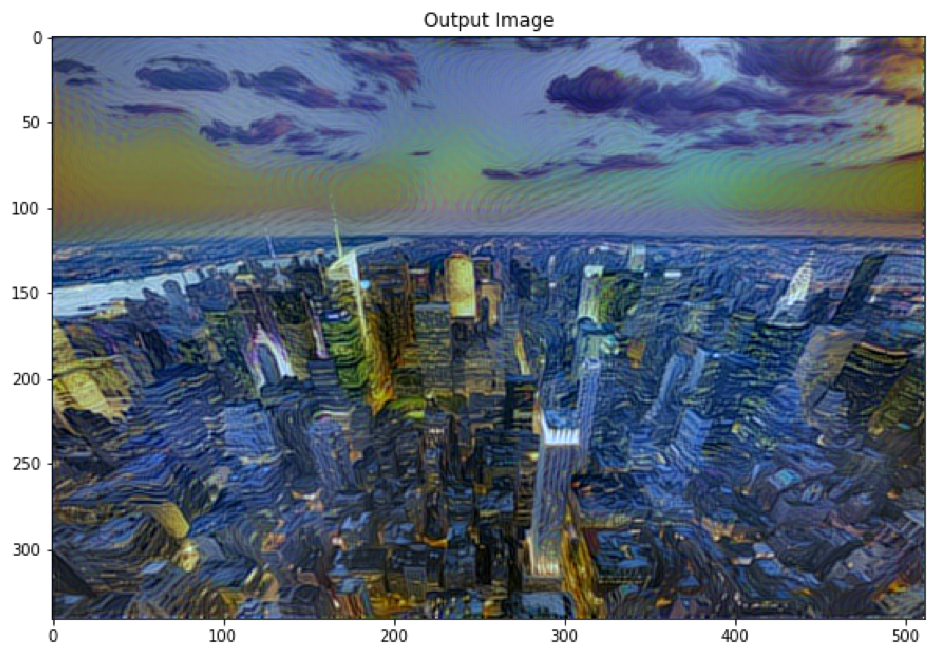
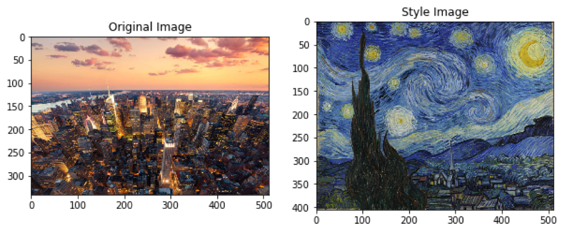

&nbsp;&nbsp;&nbsp;&nbsp;&nbsp;&nbsp;Figure 15: The stylized image from the city scape photography and Starry Night by Vincent Van Gogh

&nbsp;&nbsp;&nbsp;&nbsp;&nbsp;&nbsp;A result that got from running neural style transfer that based from Gatys research is promising. The stylized image has good quality and well rendered. But the biggest problem I have been facing using this implementation is that the computation capability of Jetson TX2 cannot handle big input image due to memory exhausting. The other big problem in this implementation is the computation time. The computation time is unacceptably slow, to stylized a single image it took around 15 minutes to run through 9 iteration. The reason behind this problem is the way implementation is being made. When we using L-BFGS to optimization and minimizing global loss of the image, the operation takes a lot of time because it needs to calculate the value pixels by pixels and that is the reason why the implementation is time consuming. Even when we run on more powerful devices, the problem also occurred.

##### Advantages of the implementation

- The algorithm is easy to understand.
- The result from algorithm is promising.
- Adjustable by changing the weight.
- Do not need to trained the model for this implementation, we can use VGGNet for our model.

##### Disadvantages of the implementation

- The computation speed is slow.
-	Resource consumption is high.

#### Conclusion

&nbsp;&nbsp;&nbsp;&nbsp;&nbsp;&nbsp;Neural style transfer using VGG16 by Gatys et al implementation works well, but due to limited computation power of Jetson TX2, using this implementation might not suit the demo application which required fast stylizing speed. That lead to a deeper research on this topic, I found out that there is a suggestion that we should train a feedforwarding model to use for image style transfer. This suggestion lead to our next implementation.

### 2nd Implementation: “Universal Style Transfer via Feature Transforms” – Yijun Li et al.

&nbsp;&nbsp;&nbsp;&nbsp;&nbsp;&nbsp;From the previous implementation, the problem we faced is high computation cost, and the performance is slow. As I made more research into this topic, I found out that using pretrained network is the solution of these problems. “Universal Style Transfer via Feature Transforms” by Yijun Li et al propose a method for style universally style transferring by reconstruction processes, with the content features being transformed at intermediate layers with regard to the statistics of the style features, in the midst of feed-forward passes. In process in each layer divide into 3 steps extract the image feature using VGG19 network, perform style transferring using “Whitening and Coloring Transforms (WCT)”, and reconstructing the image using pretrained decoder. The process work in the feedforwarding manner, the reconstructed image will move along as a new content through multi-level stylization pipeline. This implementation is rather simple yet effective style transferring with low computation cost, which suit Jetson TX2 device more than previous implementation.  The only requirement to use this implementation is to trained the decoder first.

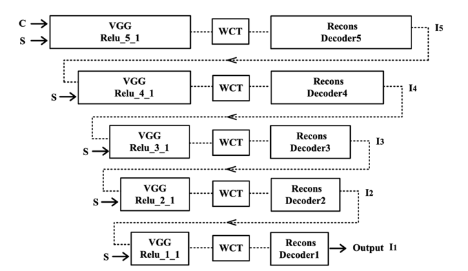

&nbsp;&nbsp;&nbsp;&nbsp;&nbsp;&nbsp;Figure 16: Overview structure of the implementation (Source: “Universal Style Transfer via Feature Transforms” – Yijun Li et al.)

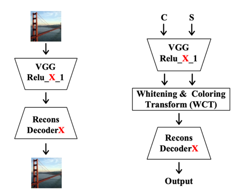

&nbsp;&nbsp;&nbsp;&nbsp;&nbsp;&nbsp;Figure 17: Reconstruction process and single level pipeline overview (Source: “Universal Style Transfer via Feature Transforms” – Yijun Li et al.)

#### Methodology

&nbsp;&nbsp;&nbsp;&nbsp;&nbsp;&nbsp;From what we briefly describe our implementation in the previous section, the implementation can be divide the process into several steps.

##### 1st step: Reconstruction the decoder

&nbsp;&nbsp;&nbsp;&nbsp;&nbsp;&nbsp;The decoder is use for inverting the VGG feature into the original image. The decoder is designed symmetrically to that of VGG-19 network. In this implementation we going to use the encoder from Relu_X_1 (X=1,2,3,4,5) layer in VGG19, so we need to train the decoder according to those layers.

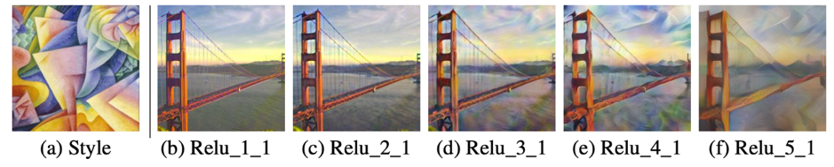

&nbsp;&nbsp;&nbsp;&nbsp;&nbsp;&nbsp;Figure 18:  Show the result of content reconstruction using each layer (Source: “Universal Style Transfer via Feature Transforms” – Yijun Li et al.)

&nbsp;&nbsp;&nbsp;&nbsp;&nbsp;&nbsp;The model in this project can be download using the shell script inside the repository including pretrained decoder(download_model.sh), and edited version of VGG19 network(download_vgg.sh).

```shell
cd WCT
./download_models.sh 
./download_vgg.sh
```

&nbsp;&nbsp;&nbsp;&nbsp;&nbsp;&nbsp;Figure 19: Model downloading command

##### 2nd step: Whitening and coloring transforms (WCT)

&nbsp;&nbsp;&nbsp;&nbsp;&nbsp;&nbsp;We use WCT to transfer the style feature of the images. The algorithm is divided into two parts Whitening transform and coloring transform. Given a pair of content image and style image Is, we first extract their vectorized VGG feature maps. Then we use WCT to transform the content feature to match the covariance matrix of style feature from VGG encoder. Then after we finish WCT we blend the output to feature content, in this process it allow us to adjust how much image will be blend by changing the value of α.


&nbsp;&nbsp;&nbsp;&nbsp;&nbsp;&nbsp;Figure 20: The inverted WCT show that the algorithm can peel of style from content image while conversing the global element of the image (Source: “Universal Style Transfer via Feature Transforms” – Yijun Li et al.)

&nbsp;&nbsp;&nbsp;&nbsp;&nbsp;&nbsp;	The implementation the WCT operation can be found in wct_tf method in Universal Style Transfer Jupyter notebook.

##### 3rd step: Multi-level coarse-to-fine stylization

&nbsp;&nbsp;&nbsp;&nbsp;&nbsp;&nbsp;As you see from the overview of the architecture in figure 17, this implementation uses multi-level pipelines under feedforwarding manners. In figure 19 we show that the higher layer features capture more complicated local structures, while lower layer features carry more low-level information (e.g., colors). This can be explained by the increasing size of receptive field and feature complexity in the network hierarchy. Therefore, it is advantageous to use features at all five layers to fully capture the characteristics of a style from low to high levels. Remind that If we reverse feature processing by starting with Relu_1_1, low-level information cannot be preserved after manipulating higher level feature.

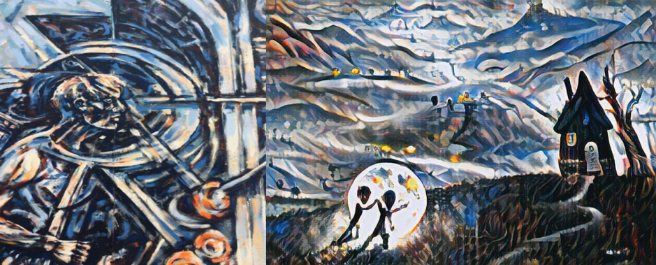

&nbsp;&nbsp;&nbsp;&nbsp;&nbsp;&nbsp;Figure 21: Sample output image (right) using this implementation

&nbsp;&nbsp;&nbsp;&nbsp;&nbsp;&nbsp;For further information, I suggest you to take a look at Universal Style Transfer Documentation; https://arxiv.org/abs/1705.08086, and the part of code using in this project is from https://github.com/eridgd/WCT-TF. For more detail of the code please use Universal Style Transfer Jupyter notebook provide in this repository.

#### Apply the implementation on Jetson TX2

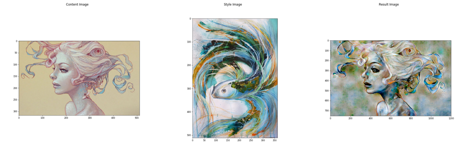

&nbsp;&nbsp;&nbsp;&nbsp;&nbsp;&nbsp;Figure 22: Output from the implementation


&nbsp;&nbsp;&nbsp;&nbsp;&nbsp;&nbsp;Figure 23: Running the image style transfer on realistic image

&nbsp;&nbsp;&nbsp;&nbsp;&nbsp;&nbsp;The result from this implementation show that this implementation has promising result and did not need high computation cost. Comparing to last implementation, this one only took around 20 second to generate first image, and use less than 10 second to generate the other one (The first stylization is longer). We’re not facing much memory exhaustion problem, unless the image is too big (in this case > 2.8 Mb. Per image). The adjusting how much style will be blend into the image is easy to adjust. As I mentioned before in the previous section, we can adjust blending option by changing the value of alpha between 0 to 1. The more alpha the more style will be blended.

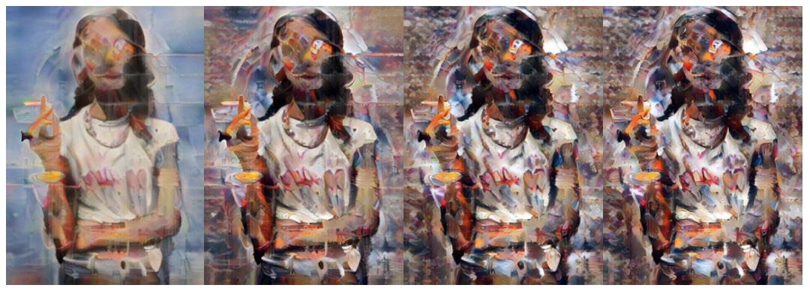

&nbsp;&nbsp;&nbsp;&nbsp;&nbsp;&nbsp;Figure 24: The results running with alpha equal 0.1, 0.4, 0.8, 1.0 (From left to right).

&nbsp;&nbsp;&nbsp;&nbsp;&nbsp;&nbsp;This implementation also allows you to preserve the original of the image, and also provide a choice of using Adaptive Instance Normalization instead of using WCT as a style transferring algorithm.

##### Advantages of the implementation
- Low computation costs
- Universally style transferring on any style images
- Adjustable
- Easy to understand
- Fast processing

##### Disadvantages of the implementation

- Have problem when dealing with extra high-resolution images.

### Demo Application 

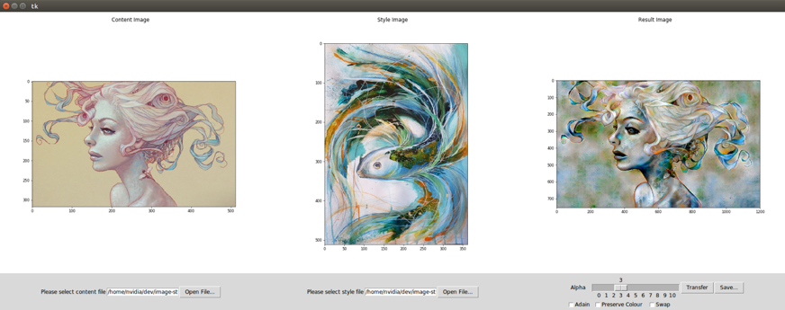

&nbsp;&nbsp;&nbsp;&nbsp;&nbsp;&nbsp;Figure 25: Demo for style transferring on image application

&nbsp;&nbsp;&nbsp;&nbsp;&nbsp;&nbsp;For the demo application, it based on Python and using Keras as a library for deep learning implementation. The demo application resided in the repository and can be run using the following command

```shell
cd src/
python Main.py
```

#### Option for the demo application
-	Adjusting alpha value
-	Choice to use AdaIN instead of WCT
-	Swap feature function
-	Save the image

#### The problem using demo application

-	Memory exhausting when processing high resolution image

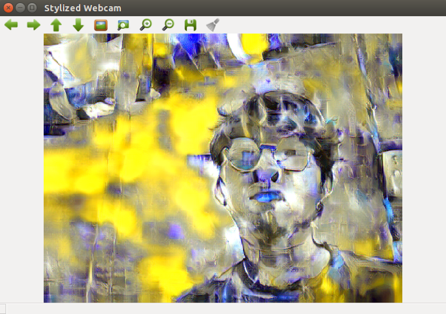

&nbsp;&nbsp;&nbsp;&nbsp;&nbsp;&nbsp;Figure 26: Webcam stylizing demo application

&nbsp;&nbsp;&nbsp;&nbsp;&nbsp;&nbsp;We also provide demo application stylizing the Webcam output, which can access using the following command

```shell
cd src/
python Webcam_demo.py
```

&nbsp;&nbsp;&nbsp;&nbsp;&nbsp;&nbsp;The Problem we’re facing using the webcam include the computation power is not enough, and the result image is different compare to the image style transferring demo, which still to be fixed. In my opinion, Jetson TX2 is not suitable for styling real-time video due to its limited computation power. The best result I’ve got is 1 frame per 5 second, which considerably slow for real-time video rendering.

## Sources and to learn more on Neural Style Transfer
- Overview of Neural Style Transfer Study : https://arxiv.org/abs/1705.04058
- Pre-trained Model and part of code from eridgd/WCT-TF Github Repository : https://github.com/eridgd/WCT-TF
- Universal Style Transfer via feature transforms by Li et al : https://arxiv.org/abs/1705.08086
- Leon Gatys Implementation in Keras : https://towardsdatascience.com/style-transfer-styling-images-with-convolutional-neural-networks-7d215b58f461
- https://deepart.io/
- PDF: M3_KEYNOTE_Foertsch_Endres.pdf
- GTC: Image Style Transfer with Torch
- VGG19 Neural Style Transfer Implementation : https://medium.com/tensorflow/neural-style-transfer-creating-art-with-deep-learning-using-tf-keras-and-eager-execution-7d541ac31398
- Deep Learing with Python. Francois Chollet - Chapter 8 : Generative Deep Learning
- Arbitrary Style Transfer : https://medium.com/artists-and-machine-intelligence/neural-artistic-style-transfer-a-comprehensive-look-f54d8649c199
- Feed Forwarding Network : https://towardsdatascience.com/deep-learning-feedforward-neural-network-26a6705dbdc7
- Arbitrary Style Transfer : http://cs231n.stanford.edu/reports/2017/pdfs/401.pdf
- Project Similar to Neural Style Transfer : https://github.com/jcjohnson/neural-style/wiki/Similar-to-Neural-Style
